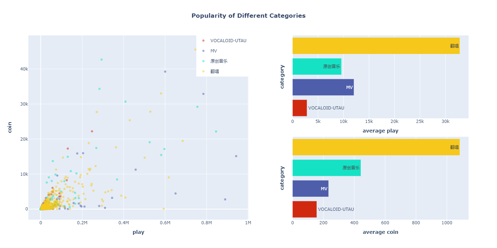
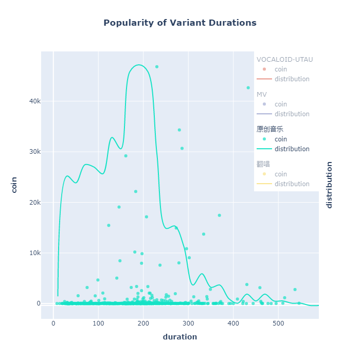
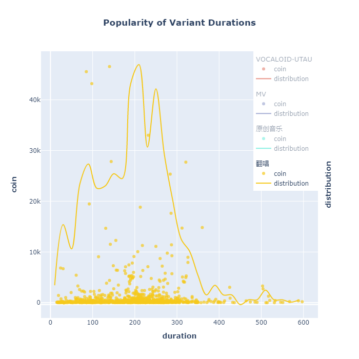
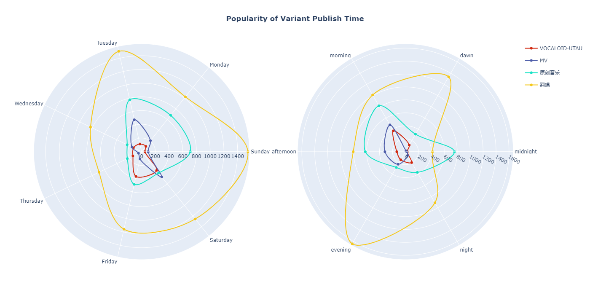

# 网络爬虫、Web 工程与数据分析

清华大学计算机系 $2021$ 年夏季小学期项目

程序及文档作者：任自厚 $2020012366$

***

## 项目结构

此处列出项目目录即各部分功能，具体设计与使用方法见[设计与用法](#设计与用法)相应章节

* `analysis`：绘图目录，其中`plot.py`用于执行绘图，会将三张图表存放在子目录`output`中
* `crawler`：爬虫目录，其中的`crawler.py`与`crawler_new.py`为独立的爬虫程序，均可实现目的（区分见[爬虫](#爬虫)）
* `data`：爬虫数据，其中的`data.sqlite3`为爬虫数据库，`cover`与`avatar`分别为存储视频封面与作者头像的目录
* `log`：爬虫日志，记录错误信息
* `static`：Web 工程静态资源目录，存放样式文件及背景图
* `templates`：Web 工程网页模板目录，存放各网页的模板
* `VideoInfo`：Web 工程主体目录，其中的`urls.py`用于配置路由，`views.py`用于处理网页请求

## 设计与用法

### 爬虫

爬虫目录中`crawler.py`与`crawler_new.py`均为爬虫脚本，其中均定义了`BiliCrawler`类，设定为爬取音乐区过去七日内热榜视频及相应作者、评论（七个子分区分别爬取前 $1000$ 名的数据）。爬取过程使用`tqdm`库进行实时的进度显示，便于掌握剩余时间。爬虫脚本随时写入数据库，支持断点续爬，且会在日志中记录报错信息而不终止程序。

执行方法为调用`BiliCrawler.crawl_all()`，如需修改样本数量，请传入参数`size=<int>`，则会爬取每个子分区前`size`页（即`size * 20`个数据）。

一次爬取往往不能得到所有信息，此时可以将日志中第一个报错的`BV`号传递给参数`start=<str>`，则程序会在本地的`data/bvid_list.txt`列表中查询该视频并从该处重新爬取（已有成功的会被跳过以减少工作量）。

**数据库**：`data/data.sqlite3`，使用轻量级的`SQLite3`数据库，其中建立三张表，分别存储视频、作者、评论信息。目前数据库中存储有 $6918$ 条视频信息、$4756$ 条作者信息。

以下为两个版本不同之处：*作业提交使用第二个版本*

**版本 A**：`crawler.py`，完全使用`api`，且使用了线程池加速爬取，速度较快，爬取全部数据只需半个小时左右（包括中途睡眠时间）。

**版本 B**：`crawler_new.py`，只在非作业要求的条目（视频时长、视频分类及`av`号，其中后两个无法从视频详情页获取）上使用`api`，通过`requests-HTML`库提供的`HTMLSession.render()`函数进行网页渲染以及下拉事件的模拟，受限于用于渲染的`Chromium`内核，不支持多线程且爬取时间较长，需要连夜爬取。

### 网页

网页采用`Django`架构，执行`python ./manage.py runserver`即可启动服务，可通过`127.0.0.1:8000`访问网页，默认为视频列表页。

网页模板使用经过[Bilibili Evolved](https://github.com/the1812/Bilibili-Evolved)美化后的[b站](https://www.bilibili.com/)搜索页、详情页代码，经过删减与调整后显示本地数据库记录的内容。

**列表页**：每页显示 $20$ 条视频或 $10$ 名作者列表，支持按钮跳转、输入页码跳转。点击每个条目后转入相应的详情页。

**视频详情页**：视频播放部分使用[b站](https://www.bilibili.com/)提供的内嵌视频代码，此外显示视频标题、播放数据、作者信息和评论内容。点击作者信息可跳转作者详情页。

**作者详情页**：显示作者头像、名称、简介、粉丝数及发布的视频。点击视频可跳转视频详情页。

**搜索**：在每个网页顶部均有搜索栏，搜索栏左侧按钮选择视频或作者。搜索结果在列表页展示，并会在输入框下方显示搜索时间以及条目计数。支持分页跳转。搜索功能通过`LIKE`语句进行数据库检索，保障了时间的可控性（本机测试搜索时间基本在 $10 ~\rm ms$ 以下）。

### 可视化

可视化包括两部分，在`plot.ipynb`中使用`lux`库提供的自动绘图（需要在`jupyter notebook`中运行），可将数据库内容两两参数绘图，便于直观感受数据关系，为后面正式的绘图确定方向。

经过基本的绘制，确定三个方向如下：

1. 播放量、硬币数与分区的关系
2. 硬币数与视频时长的关系
3. 硬币数与投稿时间（周几投稿、一天中哪个时段投稿）的关系

然后在`plot.py`中使用`pandas`库进行数据的清洗与加工，再用`plotly`库进行正式的绘图（三个函数三张图），`plotly`库默认输出可交互的网页文件，进入后可分类查看每个分区各自的数据，并可另存为图片。结果及分析见[数据分析结论](#数据分析结论)。

## 数据分析结论

数据清洗：关注音乐区中`原创音乐`、`MV`、`翻唱`、`VOCALOID·UTAU`四个子分区进行分析。使用硬币数作为衡量视频热度的标准。

1. 翻唱曲作品热度最高：从左侧散点图中可以看出，在`播放 > 0.2M`且`硬币 > 10k`的区域中，翻唱曲作品个数最多，而从右侧两个条形图中也可看出翻唱曲作品在平均播放、平均硬币两个指标上都远超其他区作品。

2. 时长较长的原创音乐作品更受欢迎：左图中曲线描绘了作品数量在每个时长区间中的大致分布，散点则描绘了每个作品的硬币-时长关系。图表表明，散点图的高峰位于曲线高峰的右侧（时长更长的一侧），可见人们更偏爱长时间的原创音乐作品。相比之下，翻唱作品（右图）并不显示出这一特征。

|  |  |
| -------------------------- | ---------------------------- |

3. VOCALOID·UTAU 作品若在周五、周六投稿，更有可能受到欢迎：从左图中可以看出在周五、周六投稿的该分区作品（红线）硬币数更高，这可能是因为该分区受众中学生居多，周末观看人数更多。上午投稿的视频更有可能受到欢迎：从右图中可以看出，除了翻唱曲，其他分区视频上午投稿收获的硬币数均为一天中最多。

